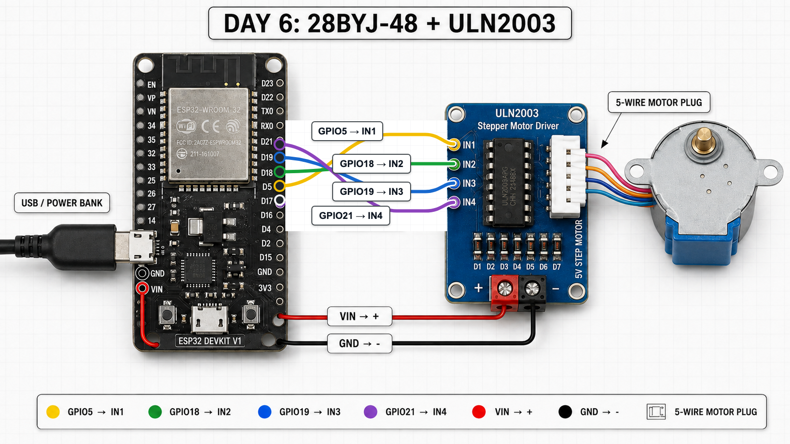

# Day 6 — Stepper Motor with ULN2003 Driver

## Goal
Control a 28BYJ-48 5V stepper motor from an ESP32 using a ULN2003 driver board, then debug the coil sequence and power arrangement until the shaft rotates reliably.

## Outcome video
Watch the working Day 6 stepper motor demo:

[](https://youtu.be/BlyWCj2tDgo)

## Realistic wiring view
Use this build view to identify the physical boards, find each ESP32 pin, and trace every connection to the ULN2003 driver.



The colored rings mark the exact ESP32 pins used in the project. Match the printed pin label as well as the wire color before powering the circuit.

## What a stepper motor is
A stepper motor moves in small fixed steps instead of spinning freely like a DC motor. Inside the motor are multiple coils. By energizing those coils in the right order, the magnetic field moves around the motor and pulls the rotor from one position to the next.

This makes steppers useful when position matters, such as gauges, small robot mechanisms, turntables, and simple automated doors.

## What the ULN2003 does
The ULN2003 board is a driver between the ESP32 and the stepper motor. The ESP32 sends low-current logic signals to IN1, IN2, IN3, and IN4. The ULN2003 uses those signals to switch the motor coils on and off.

The board also has indicator LEDs, which are useful for checking whether each input channel is being commanded.

## Why GPIO controls the driver instead of powering the motor
ESP32 GPIO pins are for control signals, not motor power. A GPIO pin cannot safely provide the current a stepper motor coil needs. Trying to power a motor directly from GPIO can cause unreliable behavior or damage the ESP32.

Instead:
- ESP32 GPIO pins control the ULN2003 inputs.
- The ULN2003 switches current through the motor coils.
- Motor power comes from VIN/GND, not from GPIO.

## GPIO assignments
| ULN2003 input | ESP32 pin |
|---|---|
| IN1 | GPIO5 |
| IN2 | GPIO18 |
| IN3 | GPIO19 |
| IN4 | GPIO21 |

## Power arrangement
Final working setup:
- ESP32 powered over USB/power bank.
- ULN2003 `+` -> ESP32 VIN.
- ULN2003 `-` -> ESP32 GND.
- 28BYJ-48 5-wire motor plug -> ULN2003 white motor socket.

## Working full-step sequence
The naive sequence using IN1 -> IN2 -> IN3 -> IN4 did not rotate the motor correctly.

The working full-step sequence was:

```text
1010
0110
0101
1001
```

The bits correspond to:

```text
IN1 IN2 IN3 IN4
```

Equivalent effective coil order:

```text
IN1 -> IN3 -> IN2 -> IN4
```

## Main code examples
Day 6 includes two main sketches.

### `day06_stepper_basic.ino`
Purpose: teach the low-level mechanics of a stepper motor before introducing a library.

The motor does not receive a simple "rotate" signal. The ESP32 repeatedly energizes different coils through the ULN2003. The order of those magnetic states determines rotation.

This low-level sketch is intentionally verbose so the stepping mechanism is visible:
- IN1-IN4 control four driver channels.
- Each `setStep(...)` call energizes a particular combination of motor coils.
- Changing the sequence moves the magnetic field around the motor.
- Repeating the sequence makes the shaft rotate.
- Incorrect phase ordering can cause vibration without rotation.

For our exact 28BYJ-48 + ULN2003 setup, the working full-step sequence is:

```text
1010
0110
0101
1001
```

The bits correspond to:

```text
IN1 IN2 IN3 IN4
```

### `day06_stepper_library.ino`
Purpose: show how Arduino's Stepper library hides the coil-sequencing details once the basic mechanism is understood.

The physical wiring remains:

```text
ULN2003 IN1 -> GPIO5
ULN2003 IN2 -> GPIO18
ULN2003 IN3 -> GPIO19
ULN2003 IN4 -> GPIO21
```

However, for this 28BYJ-48 + Stepper library combination, the constructor must use the effective coil order:

```text
IN1, IN3, IN2, IN4
```

So the sketch uses:

```cpp
Stepper motor(STEPS_PER_REV, 5, 19, 18, 21);
```

The Stepper library lets us move from low-level coil patterns to a higher-level API:

```cpp
motor.step(512);
motor.step(-512);
```

Positive and negative values move in opposite directions.

For our motor:

```text
2048 steps ~= 360 degrees
1024 steps ~= 180 degrees
512 steps  ~= 90 degrees
256 steps  ~= 45 degrees
```

We then created:

```cpp
rotateDegrees(90);
rotateDegrees(-90);
```

using:

```cpp
steps = degrees * 2048 / 360;
```

This is an abstraction:
- The basic version teaches how the motor rotates.
- The library version lets application code say what movement it wants.

Important debugging result: our attempts to manually implement forward/reverse logic became error-prone. Using Arduino's Stepper library successfully demonstrated reliable positive and negative rotation and confirmed that the ESP32, ULN2003, motor, wiring, and power path were all functioning.

## Debugging journey
- The ULN2003 LEDs sequenced, but the motor shaft only vibrated.
- Simple stepping sequences were tested first.
- A half-step sequence was also tested.
- All four ULN2003 LEDs were verified.
- All four channels produced motor vibration, proving each driver path had some effect.
- A separate breadboard power module fed by a 6F22 9V battery was tested, but it caused vibration without reliable rotation.
- The setup was changed to a power bank powering the ESP32, with ULN2003 power taken from ESP32 VIN/GND.
- The correct coil stepping order was discovered: IN1 -> IN3 -> IN2 -> IN4.

## Key lessons
- Voltage alone is not enough; current capability matters.
- Driver LED activity proves input control but not necessarily correct motor rotation.
- Stepper motors depend on correct phase order.
- Debugging works best when control, power, and motor behavior are isolated one at a time.
