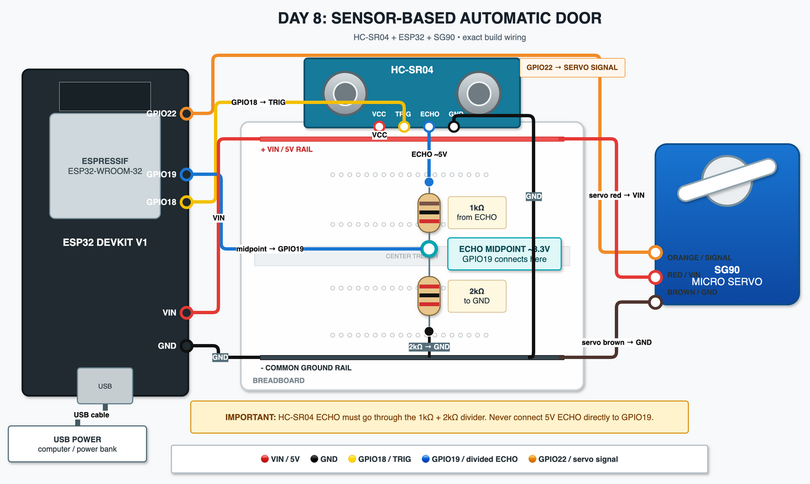

# Day 8 - Sensor-Based Automatic Door

## Goal
Build an automatic door that detects a nearby person using the HC-SR04 and opens a servo-driven door automatically.

## Components
- ESP32
- HC-SR04 ultrasonic sensor
- SG90 servo
- Breadboard
- 1kΩ resistor
- 2kΩ resistor
- Jumper wires
- USB power

## Wiring overview

### HC-SR04
- VCC -> ESP32 VIN
- GND -> ESP32 GND
- TRIG -> GPIO18
- ECHO -> 1kΩ resistor -> divider midpoint -> GPIO19
- Divider midpoint -> 2kΩ resistor -> GND

### Servo
- Orange / signal -> GPIO22
- Red -> ESP32 VIN
- Brown -> ESP32 GND

See [wiring.md](wiring.md) for the complete connection table.

## Realistic wiring diagram
This is the primary build reference. It shows the component orientation, ESP32 pins, shared breadboard power rails, and the physical ECHO voltage divider.



The editable source is in [`diagram-realistic.drawio`](diagram-realistic.drawio).

## How to read the wiring diagram
- Red wires carry VIN / 5V power.
- Black wires are ground.
- Yellow is the TRIG signal on GPIO18.
- Blue is the divided ECHO signal going to GPIO19.
- Orange is the servo signal on GPIO22.
- The realistic diagram is the primary build reference; a conceptual diagram, when present, only explains system behaviour.
- Always check the labels and orientation printed on the actual components before applying power.

## Why the ECHO voltage divider is needed
The HC-SR04 is powered from 5V and its ECHO pin can output approximately 5V. ESP32 GPIO pins use approximately 3.3V logic, so ECHO should not be connected directly to GPIO19.

The 1kΩ and 2kΩ resistors form a voltage divider. ECHO passes through the 1kΩ resistor to a midpoint. GPIO19 reads that midpoint, and the 2kΩ resistor connects the midpoint to ground. This reduces an approximately 5V ECHO signal to approximately 3.3V, which is appropriate for the ESP32 input.

## Behaviour

| Measured distance | Door behaviour |
|---|---|
| Less than 20 cm | Open immediately |
| 20-30 cm | Keep the current door state |
| Greater than 30 cm while open | Start the close timer |
| Greater than 30 cm continuously for 2 seconds | Close the door |
| Invalid reading / no echo | Keep the current door state |

The 20-30 cm range is the hysteresis zone. Entering it does not start a new action.

## New concept: state

```cpp
bool doorOpen = false;
```

`doorOpen` is the program's memory of the physical door state. The value changes to `true` after the door opens and back to `false` after it closes.

Without state, the program might repeatedly issue this command on every loop even when the door is already open:

```cpp
doorServo.write(90);
```

Tracking state prevents unnecessary servo commands and makes later decisions depend on what the door is already doing.

## New concept: hysteresis
Opening and closing at the same distance can make a mechanism unstable. A person hovering near that distance, or small measurement changes from the sensor, could produce:

```text
OPEN
CLOSE
OPEN
CLOSE
```

This project opens below 20 cm but does not consider closing until the measured distance is above 30 cm. The gap between those thresholds provides a stable region where the current door state is preserved.

## New concept: delayed close

```cpp
unsigned long farSince = 0;
```

`farSince` stores when the sensor first detected that the person was farther than 30 cm. This assignment means "remember the current time as the moment the person moved away":

```cpp
farSince = millis();
```

The program then checks:

```cpp
millis() - farSince >= 2000
```

This means "has the person remained far away for at least two seconds?" The timer is cancelled if the reading returns to 30 cm or less before those two seconds pass.

## Invalid sensor readings
`pulseIn()` may return `0` when no echo is received before its timeout. In that case, the sketch:

- Prints `No echo` to the Serial Monitor.
- Does not move the servo.
- Leaves `doorOpen` and the physical door position unchanged.

An invalid reading is missing information, so it is not treated as proof that the person moved away.

## Key lessons
- Sensor input can control a physical actuator.
- State prevents unnecessary repeated actions.
- Hysteresis prevents unstable threshold behaviour.
- `millis()` can implement timers without a long blocking delay.
- A real robot often needs to remember previous state, not just react to the current reading.
- A complete robot loop follows sensor -> decision -> physical action.
