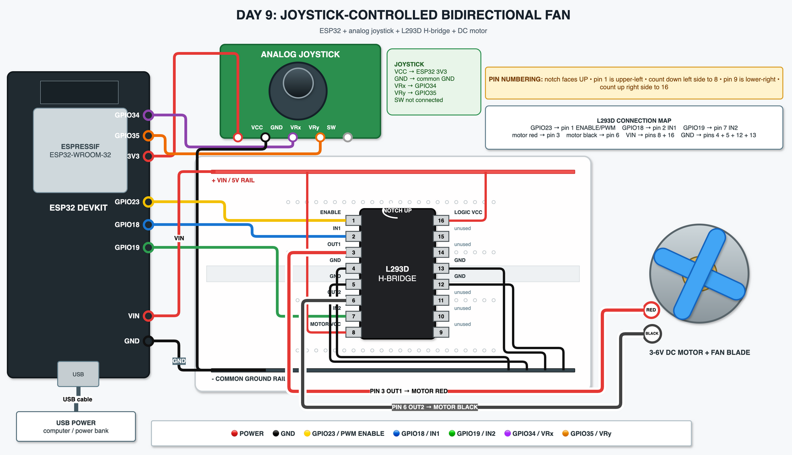

# Day 9 - Joystick-Controlled Bidirectional Fan

## Goal
Control a DC motor and attached fan blade with an analog joystick:

- Push **up** to increase the requested speed.
- Push **down** to decrease the requested speed.
- Push **left** to request anticlockwise rotation.
- Push **right** to request clockwise rotation.
- Release the joystick to retain the current speed and direction.

The final, physically tested controller also performs a soft reversal: it slows the motor to zero, pauses, changes direction, and then accelerates again. This version was tested successfully with the fan blade attached.

## Components
- ESP32 DevKit
- Joystick module
- L293D H-bridge IC
- 3-6V DC motor
- Plastic fan blade
- Breadboard
- Jumper wires
- USB power

## Development environment
Day 9 marks the move from Arduino IDE to **CLion + PlatformIO**.

- [`platformio.ini`](platformio.ini) is at the Day 9 project root.
- [`src/main.cpp`](src/main.cpp) contains the Arduino program and includes `Arduino.h`.
- PlatformIO **Build** compiles the project.
- PlatformIO **Upload** flashes the ESP32.
- PlatformIO **Upload and Monitor** flashes the board and opens serial monitoring.
- Serial monitoring runs at 115200 baud.

## Architecture

```text
Joystick
   |
   | X/Y analog values
   v
ESP32
   |
   | PWM + direction signals
   v
L293D H-bridge
   |
   v
DC motor -> fan
```

The software controller follows a related pattern:

```text
User command -> desired state -> controller -> physical state
```

## Wiring
Use the [detailed wiring guide](wiring.md) together with the realistic build diagram:



The editable diagram source is [`diagram-realistic.drawio`](diagram-realistic.drawio).

Important: even if the joystick module is labelled `+5V`, connect its supply pin to ESP32 `3V3`. Its analog outputs are derived from its supply voltage, so powering it from 3.3V keeps VRx and VRy within the ESP32 ADC input range.

## Joystick ADC readings
The ESP32 converts each joystick axis voltage into a number from approximately 0 to 4095.

| Joystick position | Approximate reading |
|---|---|
| Center | X ≈ 2000, Y ≈ 2000 |
| Up | Y ≈ 0 |
| Down | Y ≈ 4095 |
| Left | X ≈ 0 |
| Right | X ≈ 4095 |

VRx connects to GPIO34 and controls direction. VRy connects to GPIO35 and controls the target speed. The joystick push switch is not connected.

## Dead zone
The tested thresholds are:

```cpp
const int LOW_THRESHOLD = 1000;
const int HIGH_THRESHOLD = 3000;
```

| Reading | X-axis command | Y-axis command |
|---|---|---|
| Below 1000 | Request left / anticlockwise | Increase target speed |
| 1000-3000 | Retain current direction | Retain current speed |
| Above 3000 | Request right / clockwise | Decrease target speed |

The wide center dead zone prevents small analog fluctuations from continually changing commands when the joystick is released.

## What is PWM?
GPIO23 connects to L293D pin 1, the Enable input. The program controls it with:

```cpp
analogWrite(ENABLE_PIN, value);
```

A value of `0` keeps the motor stopped, while `255` represents full duty cycle. The ESP32 rapidly switches the enable signal on and off. The percentage of time the signal is on is called the **duty cycle**.

The motor's mechanical inertia makes this switching behave like variable average power, allowing speed control. PWM is not the ESP32 producing a continuously variable analog voltage.

## What is an H-bridge?
ESP32 GPIO pins provide control signals; they should not drive a DC motor directly. The L293D handles motor current and acts as an H-bridge, allowing the ESP32 to control both speed and direction.

The driver provides:

1. Motor current handling.
2. Clockwise and anticlockwise direction control.
3. PWM speed control through the Enable pin.

## Motor direction

| L293D Input 1 | L293D Input 2 | Applied direction |
|---|---|---|
| HIGH | LOW | Direction A / clockwise in this build |
| LOW | HIGH | Direction B / anticlockwise in this build |

Swapping the two motor wires would reverse the physical meaning of clockwise and anticlockwise without changing the control principle.

## State: requested versus actual
The controller distinguishes what the user wants from what is physically being applied:

```cpp
int targetSpeed;
int currentSpeed;

bool requestedClockwise;
bool actualClockwise;
```

- `targetSpeed` is the speed requested with the joystick.
- `currentSpeed` is the PWM value currently applied to the motor.
- `requestedClockwise` is the joystick's requested direction.
- `actualClockwise` is the direction currently applied to the L293D.

This distinction lets the controller move safely and gradually from its current state toward the requested state.

## Speed commands
While the joystick is held up, `targetSpeed` increases by 20 every 150 ms:

```text
0 -> 20 -> 40 -> 60 -> ... -> 255
```

Holding it down decreases the target in the same steps:

```text
255 -> 235 -> 215 -> ... -> 0
```

## Soft ramping
The motor does not jump directly to `targetSpeed`. Every 40 ms, `currentSpeed` moves toward it by 10.

For example, if `currentSpeed` is 100 and `targetSpeed` is 200, the applied values become:

```text
110 -> 120 -> 130 -> ... -> 200
```

## Soft reversal
Soft reversal is the main bonus feature for Day 9. If the motor is running clockwise at 200 and the joystick requests anticlockwise rotation, the controller performs this sequence:

```text
CW 200 -> CW 190 -> CW 180 -> ... -> CW 10 -> 0
       -> pause for 150 ms
       -> change L293D direction
       -> CCW 10 -> CCW 20 -> ... -> CCW 200
```

Instantly reversing a spinning DC motor creates a sudden mechanical and electrical load. Ramping to zero before changing direction is gentler and demonstrates a more realistic motor controller.

## What we learned
- Reading analog joystick axes with the ESP32 ADC.
- Using dead zones to stabilize analog commands.
- Controlling DC motor speed with PWM.
- Using an L293D H-bridge for motor current and direction control.
- Separating desired state from actual physical state.
- Ramping motor speed instead of changing it abruptly.
- Reversing direction only after reaching zero speed.
- Integrating user input, controller logic, and a physical actuator.
